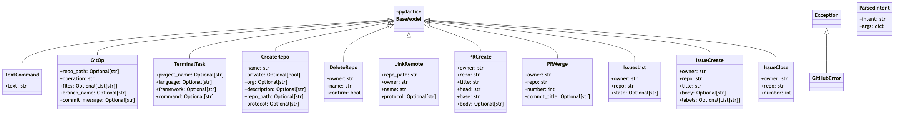

# Vani Agent – About README

     

A voice-driven developer assistant packaged as a VS Code extension plus a Python agent. It listens for a wake word, transcribes your speech, classifies the intent, and executes developer tasks (Git operations, GitHub actions, and Terminal scaffolding).

> Tip: Say “hello vani” to wake the agent, then speak natural commands like “create a React TypeScript app” or “push my repo”.

---

## Overview & Architecture

```
[Mic] → record_audio_block → [WAV] → STT (Sarvam preferred, Whisper fallback) → text
                         → Intent (LLM or heuristics) → {intent,args}
                         → Ops: git | github | terminal
VS Code extension → spawn agent (per folder) → Output/Terminal logs
```

- VS Code Extension (JavaScript): commands + sidebar to start/stop agent per workspace; multi-root support; auto pip install when missing; injects OPENAI_API_KEY and SARVAM_API_KEY if configured.
- Python Agent: audio I/O + STT (Sarvam preferred, Whisper fallback) + intent parsing (OpenAI optional, heuristic fallback) + ops runners (git, GitHub REST, macOS Terminal).
- Optional FastAPI service: HTTP endpoints for programmatic control.

## Class Diagram



---

## Languages & Runtime

| Component          | Language/Runtime                           |
|--------------------|--------------------------------------------|
| VS Code Extension  | JavaScript (Node)                          |
| Agent              | Python 3.x                                 |
| STT                | Sarvam AI (preferred) → Whisper fallback   |
| TTS                | Sarvam AI (preferred) → macOS say fallback |
| Intent Parsing     | OpenAI GPT (optional) → heuristic fallback |

---

## Configuration (.env or OS env)

| Variable                     | Default         | Purpose                                                    |
|------------------------------|-----------------|------------------------------------------------------------|
| OPENAI_API_KEY               | (empty)         | Optional: enable GPT intent parsing                        |
| SARVAM_API_KEY               | (empty)         | Enable Sarvam AI STT/TTS/translation                       |
| WHISPER_MODEL                | whisper-1       | STT model (used when Sarvam unavailable)                   |
| GPT_MODEL                    | gpt-4o-mini     | Intent parsing model                                      |
| USER_NAME                    | Sir             | Greeting name                                             |
| TTS_VOICE                    | Samantha        | macOS ‘say’ voice                                         |
| WAKE_WORD                    | hello vani      | Wake phrase                                               |
| ACTIVE_WINDOW_SECONDS        | 120             | Active session duration                                   |
| TERMINAL_AUTO_APPROVE        | true            | Auto-approve terminal opening                             |
| STT_LANGUAGE                 | auto            | STT language (auto by default)                            |
| BLOCK_DURATION               | 7.0             | Seconds per recorded clip                                 |

---

## VS Code Extension Settings (vaniAgent.*)

| Setting             | Default     | Description                                                                 |
|---------------------|-------------|-----------------------------------------------------------------------------|
| pythonPath          | python3     | Interpreter to run agent                                                    |
| agentPath           | agent.py    | Script path relative to workspace root                                      |
| openaiKey           | (empty)     | Inject OPENAI_API_KEY (recommended: set via OS/.env for security)          |
| sarvamKey           | (empty)     | Inject SARVAM_API_KEY for Sarvam AI features                               |
| runInTerminal       | false       | true → run in Terminal; false → stream logs in Output panel                |
| autoInstallDeps     | true        | Auto install soundfile/sounddevice/numpy via pip if missing                |

## Usage

- In VS Code, run “Vani: Run Agent”. Say “hello vani”, then:
  - “status of git repo”
  - “create a React TypeScript app”
  - “create a private repo named demo and push my local code”
  - “print numbers 1 to 10 in python and run it”

Optional API: run `uvicorn vani.api:app --reload` and call /command, /git, /terminal, /github/* endpoints.

## Security

- Keep secrets out of source control (.env preferred). Use OS env or secret managers.
- The extension can inject OPENAI_API_KEY and SARVAM_API_KEY, but OS-level env is recommended.
- GitHub token used only for REST and optional one-time https push; original remote restored afterward.

## Limitations

- macOS-specific (say, osascript). For other OSes, swap TTS/terminal automation.
- Requires OpenAI credentials for STT/LLM.
- Simple program generation is heuristic; extend for complex tasks.