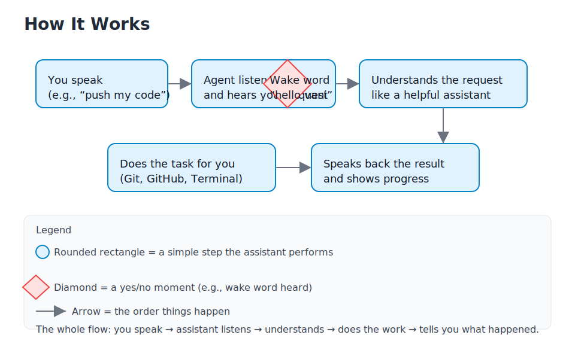
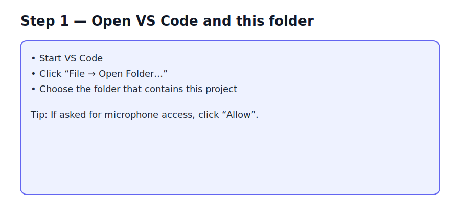
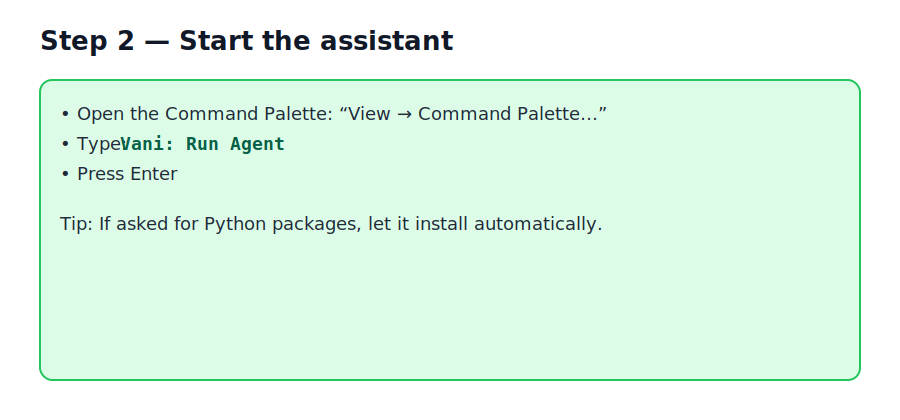
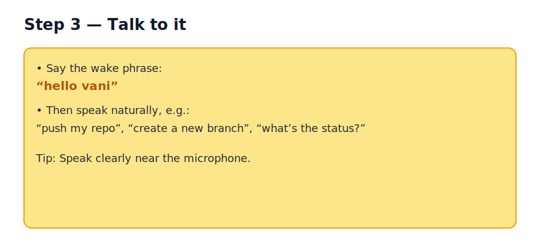

# Vani — A Friendly Voice Helper for Your Computer

Vani is like a helpful coworker who listens to you and does simple computer tasks for you. You talk, it understands, and it gets things done — such as checking project status, saving your work, or creating a new online repository.

It works inside Visual Studio Code (VS Code) using a small assistant that runs behind the scenes.

---

## 1) Project Overview

- What it does: You speak a request (“hello vani… push my code”), and the assistant carries it out.
- Who it helps: Anyone who prefers talking over typing, or wants quick, hands‑free help.
- Why it’s useful: It saves time on routine steps and explains what it’s doing in simple words.

Key features:
- Wake phrase: say `hello vani` to start
- Understands everyday commands (e.g., “what’s the status?”, “create a new branch”)
- Handles common tasks: local saving (Git), online repos (GitHub), and simple terminal actions
- Talks back with short updates so you always know what happened

---

## 2) Visual Flow Diagram

Think of Vani like a helpful concierge. You speak, it listens, understands, does the job, and then tells you what it did.



Legend (what the shapes mean):
- Rounded rectangle: a simple step the assistant performs
- Diamond: a yes/no moment (for example, did it hear “hello vani”?)
- Arrow: the order things happen

---

## 3) Installation & Usage

Follow these simple steps. No coding knowledge required.

Step 1 — Open VS Code and this folder



Step 2 — Start the assistant



Step 3 — Talk to it



Helpful tips:
- Microphone access: If your computer asks for permission, click “Allow”.
- Keys for extra features: If you have keys from your tech team (for speech or online actions), put them in a file named `.env` in this folder like:

  ```
  OPENAI_API_KEY=your_key_here
  SARVAM_API_KEY=your_key_here
  ```

- First run: VS Code may install small helper packages for the assistant. Let it continue.

Common troubleshooting:
- “It says Python packages are missing”: Let VS Code install them automatically when prompted.
- “It can’t hear me”: Check your microphone is on and close to you.
- “It says no repository found”: The assistant needs a project folder that uses Git. Ask your teammate to help turn Git on in this folder.
- “Push to GitHub failed”: Make sure your account has access and is signed in; try again or ask your teammate for access.

---

## 4) Frequently Asked Questions

- What is Vani, in plain words?
  - Imagine asking a friend to “save my work and put it online”. Vani does that type of job by listening and performing the right steps.

- Do I need to know commands?
  - No. Speak naturally: “what’s the status?”, “create a new branch”, “push my code”.

- Is it safe?
  - It uses keys (like house keys) to unlock special services only if you provide them. Keep keys in a safe place (the `.env` file or your system settings). Never share them publicly.

- Will it work without any keys?
  - Yes, core features still work, but some advanced speech/online features may be limited.

- How do I get help?
  - Open an issue in this repository or check the VS Code Output panel for messages from the assistant.

---

## 5) Design Notes

- Clear headings and consistent formatting make each section easy to skim.
- Extra spacing between lines keeps reading comfortable.
- Visual elements (flowchart and step images) break up long text.
- Simple language throughout; where technical ideas appear, they’re explained with everyday examples.

---

For engineers who want details later: there is an advanced diagram at `uml.png`, and the assistant speaks back using text‑to‑speech and listens using speech‑to‑text.